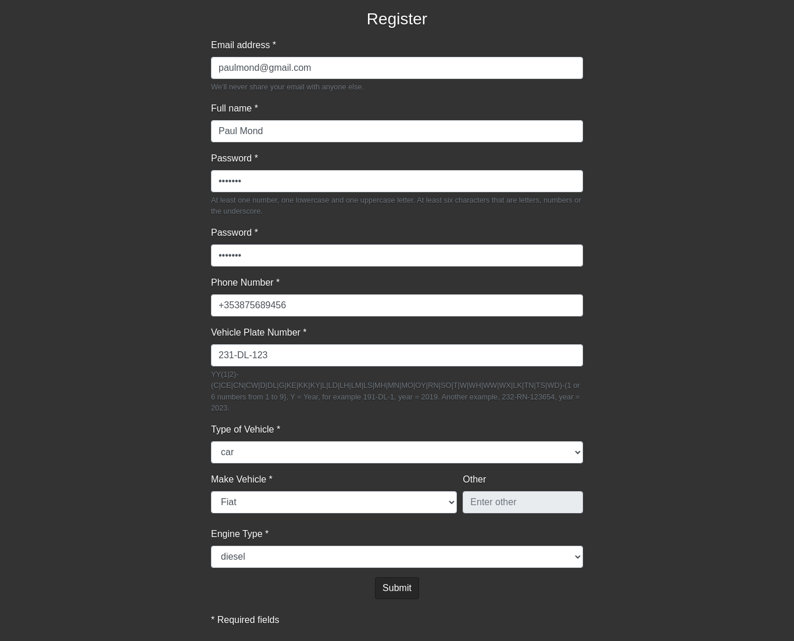

# Garage
Android Application to register activities for a garage 

The application allow a user to make a booking and display all the bookings. This program allow an administrator to display all the bookings, 
allocate mechanics, change status of the bookings and print a schedule (Pdf document)

I used Android Studio IDE, Java Programming Language and Firebase (Firestore and Authentication Service)

In ./Documentation/, we can find documentation and more information about the project:
1. Final Project - Jorge Robla - 2019070.pdf (Documentation)
2. eGarage - Jorge Robla - 2019070.pptx (Presentation)
3. flow and screens.docx (documentation)

In ./testing/, we can find videos about the mobile application (testing functionalities).

In ./WebSite/, there is a website version of Garage to be run on the browser (plus documentation and a file for installation).
Below, I paste the screenshots of the website.

